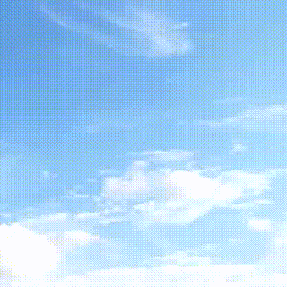

# YOLOv2によるフルーツデータセットの訓練



YOLOv2によるフルールデータセットの訓練手順を以下に示す(なお、ここで実装されたコードは全てcupyを使う事を前提としている)

## フルーツデータセットからランダム画像を生成


以下のコマンドで、画像生成器を使って各種フルーツ画像と背景をランダムに合成した画像を表示する(訓練時にも同じ様に画像生成器を使ってbatchごとにランダムな教師データを生成する)。

画像生成時には、HSV色空間のランダム変換、フルーツ画像のランダム回転、スケーリングを加えている。各パラメータは`image_generate.py`のコードを修正すれば変更できる。

```
python image_generate.py  
```


## darknet19の訓練
以下のコマンドでdarknet19のモデルの学習を行う。
`setup.sh`は、必要なディレクトリを作成する初期化スクリプト。
学習が完了すると、`backup/darknet19_final.model`に重みパラメータを保存する。

```
./setup.sh
python darknet19_train.py
```


## darknet19のテスト
以下のコマンドで、学習済みのモデルを使って、指定した画像をカテゴライズする。
テストに使用する学習済み重みのファイル等、ハイパーパラメータを変更する時は、`darknet19_predict.py`を書き換える。
デフォルトでは`backup/darknet19_final.model`の重みパラメータを読み込んでpredictionを行う。

```
python darknet19_predict.py data/grape.jpg
```

## darknet19\_448の訓練
以下のコマンドで、darknet19の学習済みモデル(`backup/darknet19_final.model`)を初期値として読み込んで、darknet19_448の訓練を行う。
パスなどは必要に応じてコード内のハイパーパラメータを修正。学習が完了すると、`backup/darknet19_448_final.model`に重みパラメータが保存される。

```
python darknet19_448_train.py
```

## darknet19\_448の重み切り出し
`partial_weights.py`のパラメータを修正して、切り出す層及び書き込み先モデルを指定する。
読み込む重みパラメータはデフォルトで`backup/darknet19_448_final.model`になっている。書き出すファイルはデフォルトで`backup/partial.model`。
書き出し先のモデル定義も、必要に応じて編集可能。
(modelとpredictorをYOLOv2GridProbに変更すればそれ用の重み切り出しが可能)
一通り修正した後で、以下のコマンドを実行すればレイヤー切り出しが行われる。

```
python partial_weights.py
```

## YOLOv2の訓練
以下のコマンドでYOLOv2を訓練する。
デフォルトでは`backup/partial.model`からweightsを重みの初期値として読み込む。学習が完了すると、`backup/yolov2_final.model`に重みパラメータが保存される。

```
python yolov2_train.py
```


## YOLOv2のテスト
以下のコマンドで、学習済みのモデルを使って、指定した画像内で物体検出を行う。

```
python yolov2_predict.py data/apple.jpg 
```